# Valheim Client Mod Install Instructions
This README details how to setup your local Valheim game install to be able to run required Valheim game mods. These mods are required in order to interact with the Cityhallin Modded Dedicated Valheim Server. This server is meant for **friends and family**. Due to its low usage, the server is not running 24/7. If more friends and family use it, I can adjust the server to run longer every day. Current server runtime schedule below:
```
Available Monday-Friday between 3:00pm and 1:30am PST
Available Saturday-Sunday between 10:00am and 1:30am PST
```

## Update Tracking
Visit the [Update Notes Wiki](https://github.com/CityHallin/valheim/archive/refs/heads/main.zip) to track server changes.

<hr />
<br />

## Install Valheim Mods on Your Local Machine (Windows)

- Open Steam, click on your Valheim game, and see if it needs updates. If it needs updates, it will have a blue **Update** button, if it is already up to date, it will have a green **Play** button. 

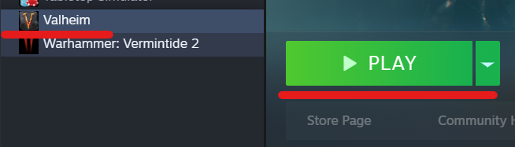
<br />
<br />
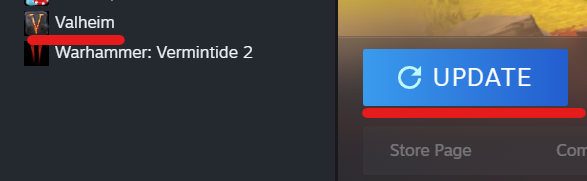
<br />
<br />

- Still in Steam, right click on Valheim and click **Properties**

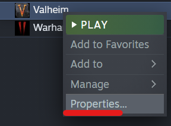
<br />
<br />

- Go to **Local Files** and click the **Browse** button. This will show you where your local **Valheim Game folder** is located. In this example, mine is stored in the C:\Program Files\SteamLibrary\steamapps\common\Valheim folder. Keep that folder location handy as you'll need to know it for later.

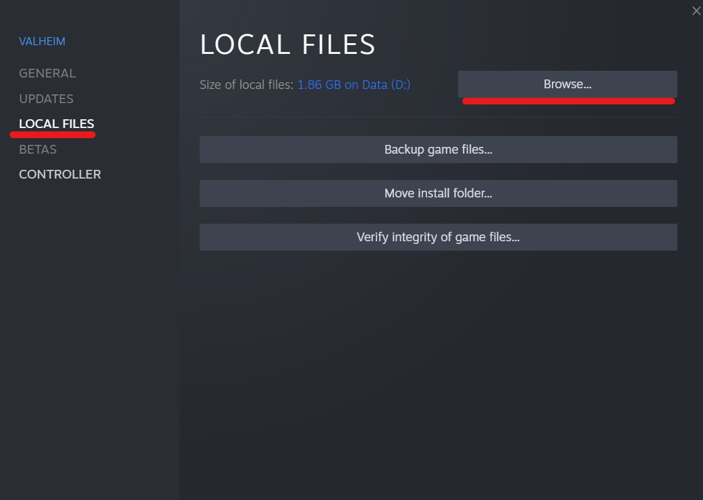
<br />
<br />
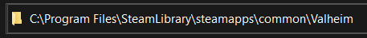
<br />
<br />

- Open your internet browser and navigate to my Valheim GitHub Repo website --> [HERE](https://github.com/CityHallin/valheim/archive/refs/heads/main.zip). Going to this website should automatically download a ZIP folder that holds all of the mod files you will need that I already pre-packaged to make it easy. The ZIP folder should be called **valheim-main.zip**. 

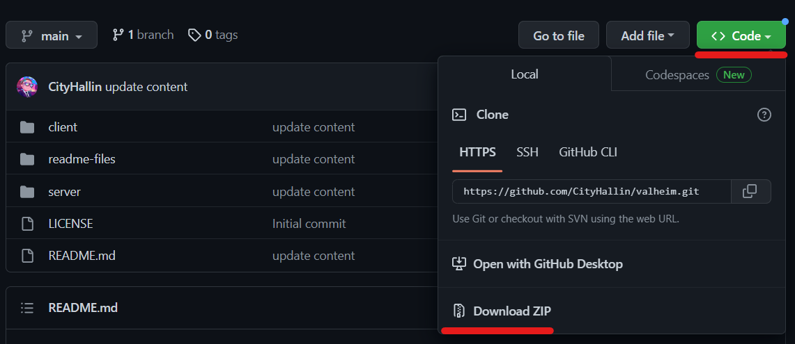
<br />
<br />

- On your local machine, go to the folder location where **valheim-main.zip** was downloaded, right click it, and select **Extract All**.

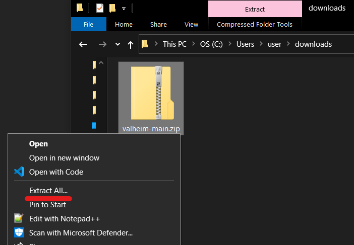
<br />
<br />

- A pop-up window will appear asking where to Extract the files. Accept the default and click **Extract**. This will create a folder valled **valheim-main** with all of the files we need inside it. 

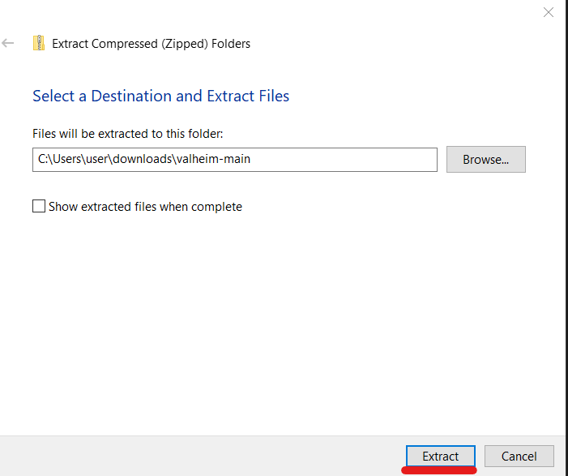
<br />
<br />

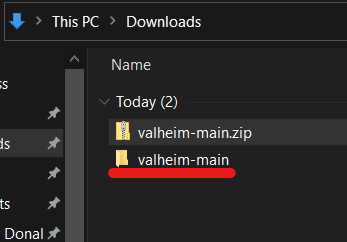
<br />
<br />

- Navigate to the new **valheim-main** folder that was just created from the extraction (there may be a duplicate valheim-main folder inside the first valheim-main folder. Just click into that duplicate folder). The content of the **valheim-main** folder should have the following items
  
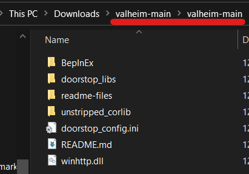
<br />
<br />

- Copy all of the files from the **valheim-main** folder to your **Valheim Game folder** you found earlier. If the copy process asks to overwrite files, select **Replace files in the destination.**

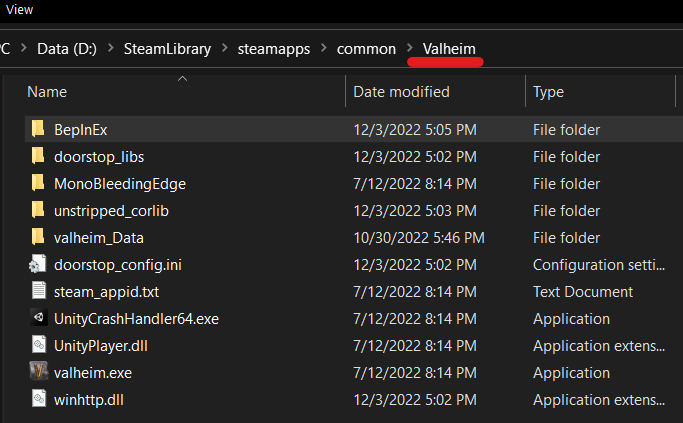
<br />
<br />

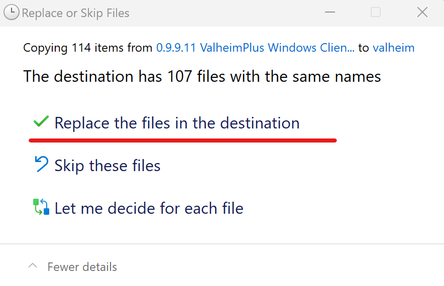
<br />
<br />

- Once the copy of the files is done, that is it. Your local **Valheim Game folder** should have everything it needs to connect with the Cityhallin Modded Dedicated Valheim Server.

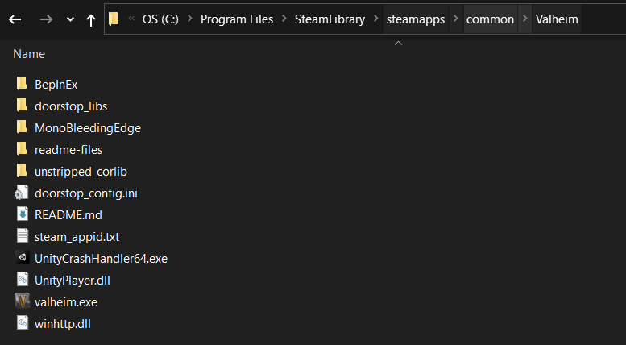

<hr />
<br />

## Connect to Valheim Server

- Open Steam , click on **View**, click on **Servers**

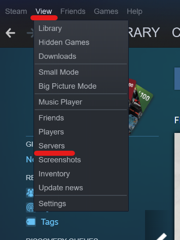
<br />
<br />

- Click **Add A server**

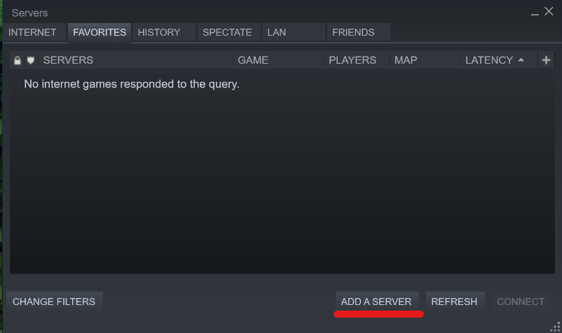
<br />
<br />

- Enter the Cityhallin Modded Dedicated Valheim Server address and port number provided to friends/family by me and click **Add this address to favorites**

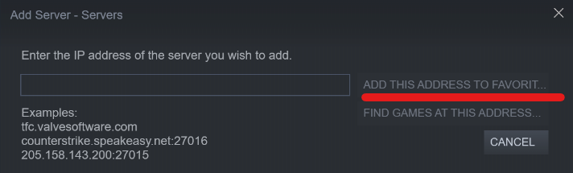
<br />
<br />

- The Cityhallin server should appear and show the live player count. Double-click on the server and another pop-up will appear asking for the password. Enter the password provided to friends/family by me and click **Connect**

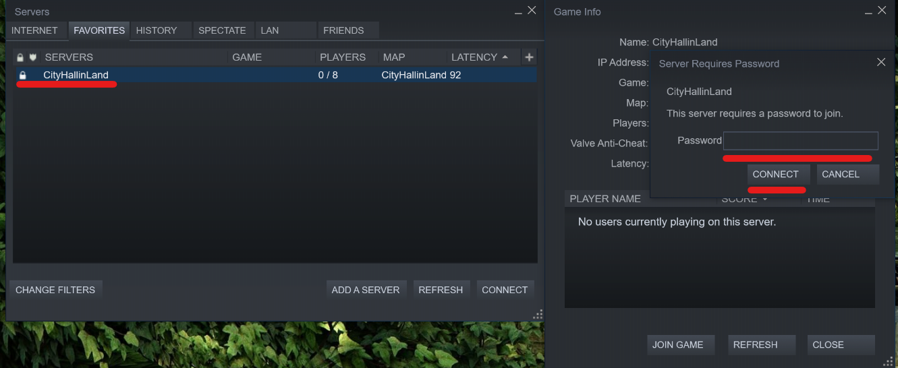
<br />
<br />

- The game will now start. If you see the Black screen appear while Valhein is starting, this is **normal**. Just minimize the black screen (do not close it).

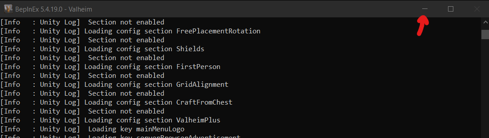


