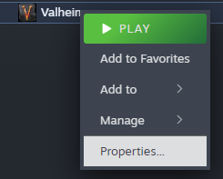
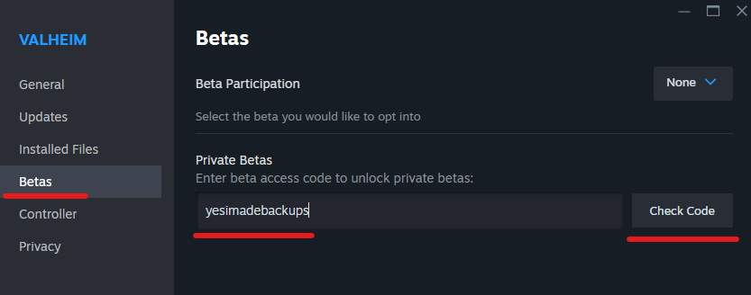
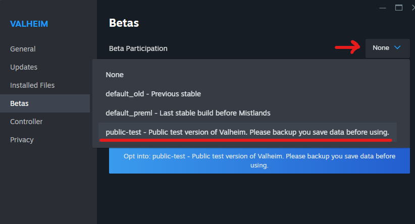
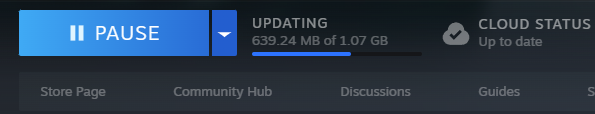

# Beta Testing

When beta testing Valheim (either locally or connecting to a beta Valheim Dedicated Server), your client install of Valheim must be set up to allow for the testing version of the game. 

**If you have any local world saves, make sure to save backups of them to a safe location outside of the Valheim local install folder before starting this process**

- Open your Steam Game Library, right click on Valheim and select **Properties**.


<br />

- Go to the **Betas** section. In the Private Betas field, add the access code below and click **Check Code**. A message should appear saying you can now opt-in to the public testing beta installs. 

```
yesimadebackups
```


<br />

- In the same properties window, click on the drop down box at the top right and select **public-test - Public test version of Valheim...**. 


<br />

- You should see your game display name change to **Valheim [public-test]** and start to download the game files automatically. 


<br />


<br />