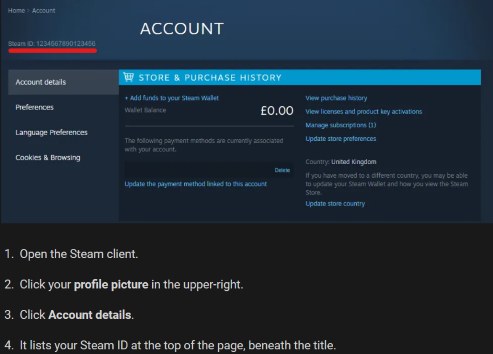

# Get SteamID 

In order to be an admin on a Valheim server, an existing admin will need to add your Steam ID to the admin list on the server. Use the steps below to gather this information. Once you have your Steam ID, give this to the server admin running the Valheim server.

 
 
