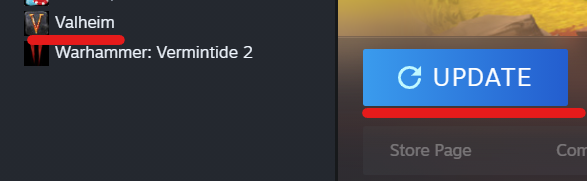
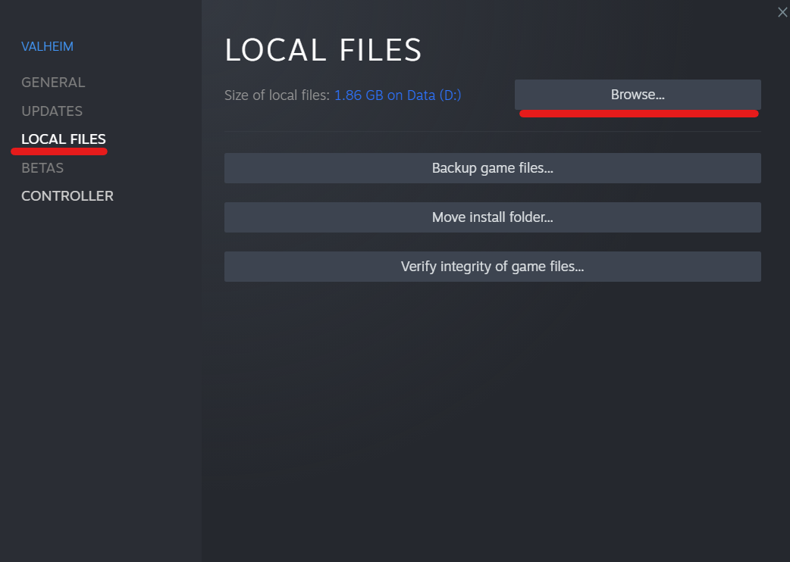
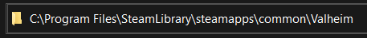
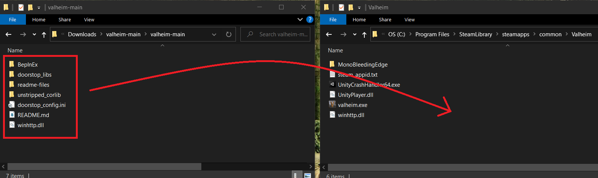

# Valheim Mod Install and Admin Instructions

### Table of Contents
- [Update Valheim](#update)
- [Install Valheim Mods](#install)
    - [Scripted Install](#auto)
    - [Manual Install](#manual)
- [Admin Instructions](#admin)

## Update Valheim <a name="update"></a>
- Open Steam, click on your Valheim game, and see if it needs updates. If it needs updates, it will have a blue **Update** button, if it is already up to date, it will have a green **Play** button. 


<br />
<br />

<br />
<br />


## Install Valheim Mods<a name="install"></a>

The instructions below will walk you through how to install the pre-setup client mods on your local Valheim client. 

> Important: This process currently only works with Windows machines. 

- In your Steam Game Library, right click on Valheim and click **Properties**


<br />
<br />

- Go to **Local Files** and click the **Browse** button. This will show you where your local **Valheim Game folder** is located. In this example, mine is stored in the C:\Program Files\SteamLibrary\steamapps\common\Valheim folder. Keep that folder location handy as you'll need to know it for later.


<br />
<br />

<br />
<br />

### Scripted Install<a name="auto"></a>

- If you'd like to use an automated script to download the available mods, click on the [install_client_mods.ps1](https://github.com/CityHallin/valheim/blob/main/scripts/install_client_mods.ps1) link to navigate to my repo and click on the **Download Icon** button to download the PowerShell script. You may need to also right click on the script once downloaded > Properties > check the box for **Unblock** at the bottom to allow it to run. 


<br />
<br />

> Important: When downloading any scripts from the internet, get into the habit of reviewing them for safety before ever running them on your local machine. 

- Running this script will do the following:
    - Ask for confirmation to start
    - Ask which mod you'd like to install from my GitHub repo
    - Ask for the **Valheim Game folder** location you gathered earlier
    - Will backup your currently Valheim game folder
    - Will download the mod ZIP file, install the selected Valheim mod, and remove the downloaded ZIP file


<br />
<br />

### Manual Install<a name="manual"></a>

Follow the steps below to manually install the Valheim mods:

- Backup up your existing **Valheim Game folder** you found earlier.

- Click on one of the links below to download the mod ZIP file of choice:
    -  [Valheim Admin Mod - DevCommands](https://github.com/CityHallin/valheim/raw/main/client_mods/client_mod_devcommands.zip). This is used if you will be an admin or a moderator on a Valheim server. This grants you the ability to run admin commands like spawning items, kicking users, etc.
    -  [Valheim Plus Mod](https://github.com/CityHallin/valheim/raw/main/client_mods/client_mod_valheimplus.zip). This is used if you will be on a Valheim Plus modded server as a regular player and required for granting Valheim Plus abilities. 

- Go to the download ZIP file, right click it and extract its content.


<br />
<br />

- Copy all of the files from the extracted ZIP file to your **Valheim Game folder** you found earlier. If the copy process asks to overwrite files, select **Replace files in the destination.**


<br />
<br />

- Your local **Valheim Game folder** should have everything it needs for you to be an admin on a Valheim Dedicated Server. 


<br />
<br />

## Admin Instructions <a name="admin"></a>

The **Valheim Admin Mod - DevCommands** is required in order to continue. Use the install instructions above to install this mod on your local Valheim client game. 

### Get SteamID <a name="steamid"></a>

Follow the instructions here to get your steam ID which may be needed later from the server admin to allow your user access to run commands on the server: [Get Steam ID](https://github.com/CityHallin/valheim/blob/main/client_mods/get_steam_id.md)

Once you have the **Valheim Admin Mod - DevCommands** installed on your local machine and the server admin has added your SteamID to the Valheim server's admin list, you can now run admin commands on that Valheim server. Here are some of the commands. 

### Server Stats

Click on the **F2** key in game to pull up the server stats overlay. This will show your player names, SteamIDs, and some server stats. 

### Enable Dev Commands

Click on the **F5** key in game to pull up the server console. Type the **devcommands** command to both enable or disable admin commands. Enabling this will allow for admin commands to be run. 

### Kick Players
Use the **kick** command in the game to kick a player's character or the player's entire Steam Account. Use against the player's character name or SteamID.

### Ban - Unban Players
Use the **ban** command in the game to ban a player's character or the player's entire Steam Account. 
<br />
Use the **unban** command in the game to unban a player's character or the player's entire Steam Account. 
<br />
Use the commands against the player's character name to just ban the player's character. They can still join with other Valheim characters.
<br />
 Use the player's SteamID to ban or unban the human player's entire Steam Account from on the Valheim Server. 

### Fly
Use the **fly** command toggle enable and disable flying ability for just your character. If you are in the air and disable fly, you will take fall damage. 
- Space Bar: Character flys up
- CRTL: Character flys down

### Spawn Items
Use the **spawn** command to spawn items that any character can use. Use the following format: <i>spawn item number</i>. Example, to spawn 10 wood:
```
/spawn wood 10
```
Here is a list of items that you can spawn --> [Item List](https://www.reddit.com/r/valheim/comments/lig8ml/spawn_item_command_list/)
