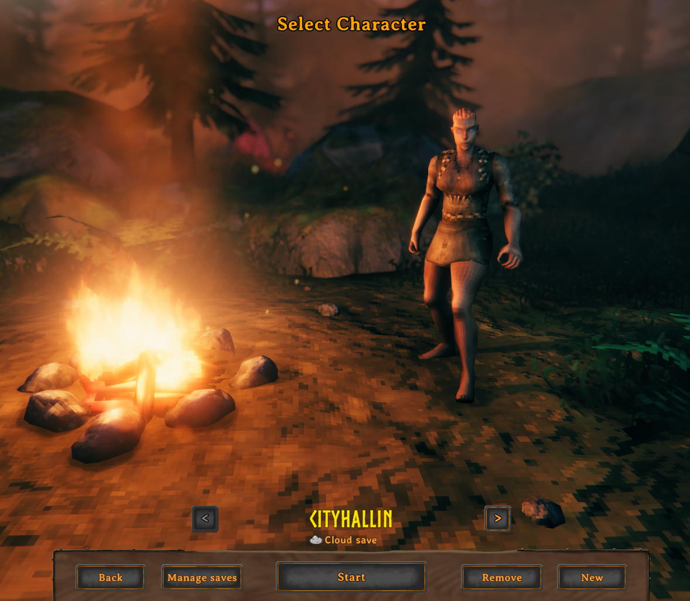
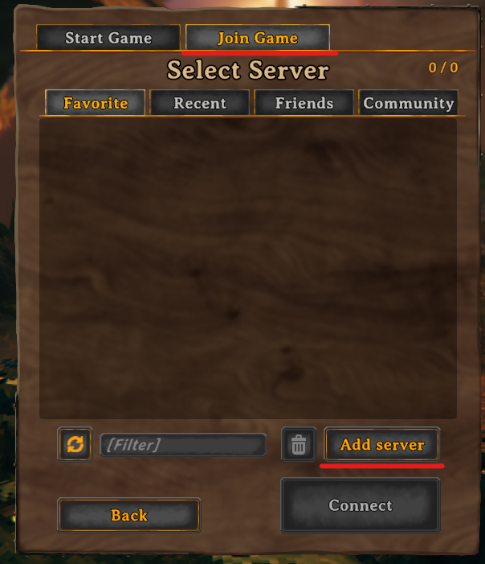
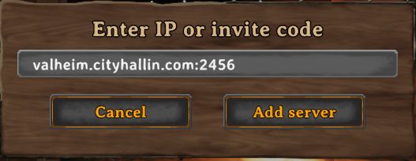
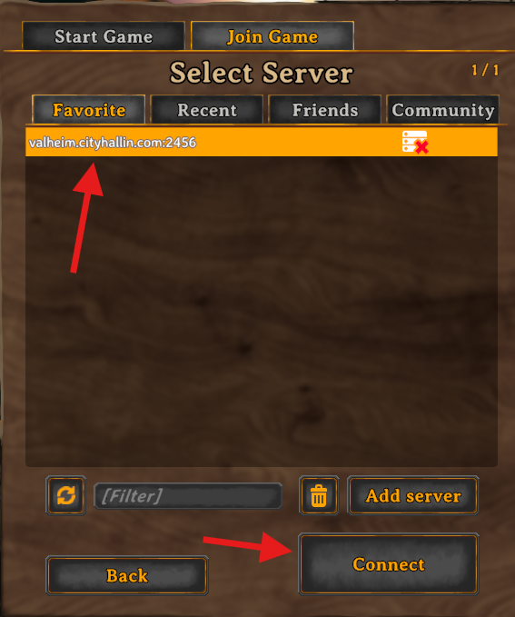
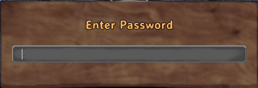
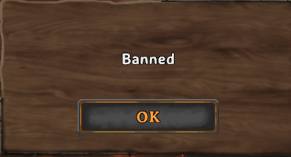

# Add Dedicated Server

Instructions below for adding a Valheim Dedicated server to your in-game list.

- Start Valheim from Steam


<br />

- Pick or create your character and click **Start**.


<br />

- In the game menu, navigate to the **Join Game** tab and click **Add Server**.


<br />

- Get the server name from the admin of the dedicated Valheim server. It will have either an IP address or URL followed by a port number (example below). Enter the server IP or URL and port number here and click **Add Server**.

```
servername.cityhallin.com:2456
```


<br />

- Select the new server you just added from your server list and click **Connect**.


<br />

- If the game server has a password, it will prompt for you to enter it. 


<br />

- If you receive the **Banned** message below, it is either:
    - The server may be limited by server admins to permitted users only to reduce malicious players from raiding the server. Contact server admins for more information on getting access.
    - You have been purposefully restricted from accessing the server by server admins.


<br />
